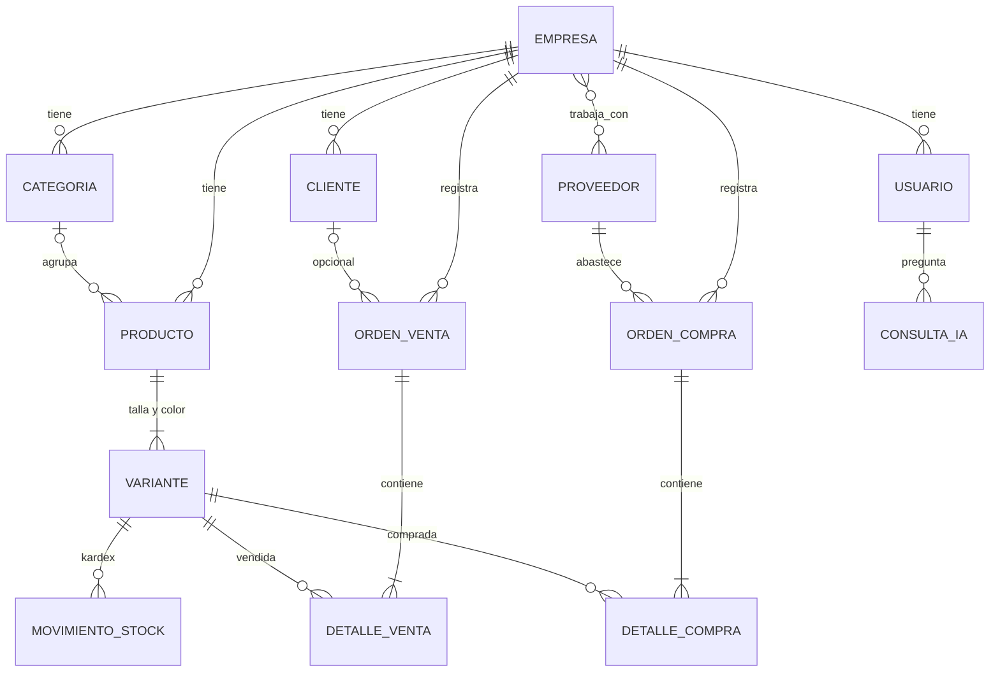

# Tienda Clara: ERP con asistente de IA para minoristas de Gamarra

**Curso:** CS 2031 Desarrollo Basado en Plataforma

**Integrantes:**
- Gabriel Murillo Machicao
- Héctor Sebastián Choque Dueñas
- Javier Bravo Chávez
- Rafael Vargas Portocarrero
- Indira Shian Yábar Ramos

---

## Índice

1. [Introducción](#introducción)
2. [Identificación del Problema o Necesidad](#identificación-del-problema-o-necesidad)
3. [Descripción de la Solución](#descripción-de-la-solución)
4. [Modelo de Entidades](#modelo-de-entidades)
5. [API REST](#api-rest)
6. [Manejo de Errores](#manejo-de-errores)
7. [Medidas de Seguridad Implementadas](#medidas-de-seguridad-implementadas)
8. [Eventos y Asincronía](#eventos-y-asincronía)
9. [GitHub & Management](#github--management)
10. [Ejecución local y despliegue](#ejecución-local-y-despliegue)
11. [Conclusión](#conclusión)
12. [Apéndices](#apéndices)

---

## Introducción

### Contexto
Gamarra, en La Victoria (Lima), es el emporio textil más grande del Perú y reúne a miles de pequeños negocios de venta de ropa. La mayoría son minoristas que atienden en un puesto o galería y también venden por WhatsApp, Instagram o TikTok. Estos negocios manejan mucha mercadería variada (el mismo modelo en varias tallas y colores), cobran por varios medios (efectivo, Yape, Plin) y compran constantemente a talleres y mayoristas.

### Objetivos del Proyecto
- Dar a cada negocio un sistema para registrar su catálogo, inventario, compras y ventas.
- Controlar el stock a nivel de **talla y color**, con un historial (kardex) de cada movimiento.
- Calcular la **ganancia real** de cada venta, considerando el costo y las rebajas por regateo.
- Ofrecer reportes que respondan preguntas del día a día del negocio.
- Incorporar un **asistente de IA** que explique esos datos en lenguaje sencillo, de forma segura y sin mezclar información entre negocios.

## Identificación del Problema o Necesidad

### Descripción del Problema
El minorista de Gamarra suele llevar su negocio en cuadernos o de memoria. Sabe cuánto vendió en el día, pero no puede responder con facilidad qué modelo le deja más ganancia, qué talla se le acaba primero, cuánto dinero pierde en rebajas o qué mercadería lleva semanas sin venderse. Esto lleva a reponer stock a ciegas, a quedarse sin las tallas que más salen en temporada alta y a tener dinero inmovilizado en prendas que no rotan.

### Justificación
Estos negocios operan con márgenes pequeños, así que una mala decisión de compra impacta directamente en su liquidez. Las herramientas ERP existentes son caras o están pensadas para empresas grandes. Un sistema simple, adaptado a la forma de trabajar de Gamarra y con un asistente que traduzca los números a recomendaciones, permite que el comerciante tome decisiones con datos sin necesidad de conocimientos técnicos.

## Descripción de la Solución

### Funcionalidades Implementadas
| Módulo | Qué resuelve |
|---|---|
| **Empresas, usuarios y roles** | Cada negocio se registra y su dueño (ADMIN) crea las cuentas de sus empleados (EMPLEADO). Toda la información queda aislada por empresa. |
| **Catálogo** | Categorías, productos (modelos) y **variantes por talla y color**, con precio de lista y costo. Se usa borrado lógico para no perder historial. |
| **Inventario y kardex** | Entradas, salidas, devoluciones y ajustes por conteo físico. Cada movimiento guarda el stock anterior y el resultante. |
| **Compras** | Órdenes a proveedores que suman stock automáticamente. |
| **Ventas** | Ventas con medio de pago y canal. El cliente es opcional. Descuentan stock y guardan el precio de lista y el costo del momento, para calcular ganancia y descuento reales. |
| **Reportes** | Resumen del periodo (ventas, ganancia, margen, ticket promedio), ranking de productos, ventas por medio de pago, canal, categoría, día u hora, stock bajo y stock parado con el capital inmovilizado. |
| **Asistente de IA** | `POST /api/v1/assistant`: responde preguntas como *"¿Qué me conviene reponer?"* usando solo los reportes del negocio del usuario. Tiene límite diario e historial. |
| **Notificaciones por correo** | Bienvenida al registrarse, alerta de stock bajo después de una venta y confirmación de cada compra registrada. |

### Tecnologías Utilizadas
- **Lenguaje y framework:** Java 21, Spring Boot 4.1 (Web MVC, Data JPA, Validation, Security, Mail)
- **Base de datos:** PostgreSQL 16, levantada con Docker Compose en desarrollo
- **Seguridad:** Spring Security, JWT (jjwt 0.12), BCrypt
- **IA:** Spring AI 2.0 con **Google Gemini 2.5 Flash** (API externa) y *tool calling*
- **Correo:** JavaMailSender (SMTP) con plantillas **Thymeleaf**
- **Otros:** Lombok, Maven, Docker, GitHub Actions, Postman

## Modelo de Entidades

### Descripción de Entidades
| Entidad | Atributos principales | Relaciones |
|---|---|---|
| `EnterpriseModel` | RUC (único), razón social, fecha de registro | N:M con proveedores. Es la raíz de todos los datos del negocio. |
| `UserModel` | nombre, email (único), contraseña (BCrypt), rol | N:1 con empresa. Implementa `UserDetails`. |
| `SupplierModel` | RUC, razón social, contacto | N:M con empresas |
| `ClientModel` | documento (DNI/RUC, único por empresa), nombre, contacto | N:1 con empresa |
| `CategoryModel` | nombre (único por empresa), descripción, activo | N:1 con empresa |
| `ProductModel` | código (único por empresa), nombre, precio de compra, precio de venta, activo | N:1 con empresa y categoría; 1:N con variantes (`cascade = ALL`, `orphanRemoval`) |
| `ProductVariantModel` | talla, color, SKU, stock, stock mínimo, `@Version` | N:1 con producto (único por producto, talla y color) |
| `StockMovementModel` | tipo (ENTRADA, SALIDA, DEVOLUCION, AJUSTE), cantidad, stock anterior y resultante, motivo | N:1 con variante y, opcionalmente, con la orden que lo originó |
| `PurchaseOrderModel` / `PurchaseOrderLineModel` | fecha, estado, total / cantidad, precio | N:1 con empresa y proveedor; 1:N con detalles |
| `SalesOrderModel` / `SalesOrderLineModel` | fecha y hora, estado, medio de pago, canal, total / cantidad, precio cobrado, precio de lista, costo | N:1 con empresa y cliente (opcional); 1:N con detalles |
| `AiQueryModel` | pregunta, respuesta, exitosa, fecha | N:1 con usuario (`LAZY`, `ON DELETE CASCADE`) y con empresa |

Las restricciones se aplican en la base de datos (`nullable`, `unique`, `@UniqueConstraint` compuestas por empresa, `precision/scale` en los montos e índices en las claves ajenas más consultadas) y en la aplicación (`@Valid`, `@NotBlank`, `@Size`, `@Min`, `@Email`, `@Pattern`, `@DecimalMin`). Las reglas de negocio viven en las entidades; por ejemplo, `ProductVariantModel.decreaseStock()` impide vender más de lo que hay.

## API REST

Todos los recursos están versionados bajo `/api/v1` y en plural. Requieren
`Authorization: Bearer <token>`, salvo el registro, el login, la renovación de token y
la creación de una empresa nueva.

| Recurso | Operaciones |
|---|---|
| `/auth` | `POST /register`, `POST /login`, `POST /refresh` |
| `/enterprises` | `POST`, `GET /{id}` |
| `/users` | `POST`, `GET`, `GET /me`, `DELETE /{id}` |
| `/categories` | `POST`, `GET`, `GET` · `PUT` · `DELETE /{id}` |
| `/products` | `POST`, `GET`, `GET` · `PUT` · `PATCH` · `DELETE /{id}` |
| `/products/{id}/variants` | `POST`, `GET` |
| `/variants/{id}` | `GET`, `PUT`, `DELETE` |
| `/clients` | `POST`, `GET`, `GET` · `PUT` · `DELETE /{id}` |
| `/suppliers` | `POST`, `GET`, `GET /{id}` |
| `/purchase-orders` | `POST`, `GET /{id}` |
| `/sales-orders` | `POST`, `GET /{id}` |
| `/stock-movements` | `POST /inbound` · `/outbound` · `/returns` · `/adjustments`, `GET /variants/{id}`, `GET /low-stock` |
| `/reports` | `GET /summary` · `/top-products` · `/grouped-sales` · `/low-stock` · `/stale-stock` |
| `/assistant` | `POST`, `GET /history` |

El detalle de cada endpoint, con ejemplos de body y respuesta, está en
`postman_collection.json`.

## Manejo de Errores

Un `@RestControllerAdvice` centraliza todas las excepciones y responde siempre en formato **ProblemDetail (RFC 9457)**: `status`, `title`, `detail`, `instance` (la ruta) y `timestamp`. Así el cliente recibe errores consistentes y nunca ve trazas internas.

| Excepción | Código | Cuándo ocurre |
|---|---|---|
| `MethodArgumentNotValidException`, `HttpMessageNotReadableException`, `MethodArgumentTypeMismatchException`, `InvalidOperationException` | 400 | Datos inválidos, JSON mal formado, parámetros mal escritos u operaciones no permitidas |
| `BadCredentialsException`, `InvalidTokenException` | 401 | Email o contraseña incorrectos, o refresh token inválido |
| `AccessDeniedException`, `ForbiddenException` | 403 | Rol insuficiente, o referencia a un recurso de otra empresa en el cuerpo |
| `ResourceNotFoundException` | 404 | El recurso no existe, o pertenece a otra empresa |
| `DuplicateResourceException`, `InsufficientStockException`, `ObjectOptimisticLockingFailureException` | 409 | Duplicados, stock insuficiente o modificación concurrente del mismo recurso |
| `QueryLimitExceededException` | 429 | El usuario superó su límite diario de preguntas a la IA |
| `Exception` (genérico) | 500 | Error inesperado, con un mensaje neutro |
| `AssistantUnavailableException` | 503 | El proveedor de IA no respondió |

Manejar estos casos de forma global evita duplicar `try/catch` en los controllers, garantiza códigos HTTP correctos y protege información sensible.

## Medidas de Seguridad Implementadas

### Seguridad de Datos
- **Autenticación con JWT sin estado:** el login devuelve un *access token* firmado (HMAC) con el email, el rol y el `empresaId`, que vence en 15 minutos, y un *refresh token* de 7 días para renovarlo en `POST /api/v1/auth/refresh`. Ambos llevan un claim `type`, así que un refresh token no sirve para acceder a endpoints protegidos. `JwtAuthenticationFilter` los valida en cada request.
- **Contraseñas con BCrypt** y política mínima: 8 caracteres, una mayúscula y un número. El email es único y la contraseña nunca se incluye en las respuestas.
- **Roles `ADMIN` y `EMPLEADO`**, guardados en la base de datos y en el token, con `@PreAuthorize` en los endpoints sensibles (reportes, eliminar recursos, gestión de usuarios).
- **Aislamiento por empresa:** la empresa siempre se obtiene del usuario autenticado (`@AuthenticationPrincipal`), nunca del request. Los services verifican que cada recurso pertenezca a esa empresa.
- **IA segura por diseño:** Gemini no accede a la base de datos. Solo puede invocar herramientas de lectura (`@Tool`) creadas para cada pregunta y fijadas a la empresa del token. El EMPLEADO no recibe las herramientas de información financiera.
- **Secretos fuera del código:** la clave JWT, las credenciales de la base de datos, del correo y de Gemini se leen de variables de entorno (`.env`, ignorado por Git).

### Prevención de Vulnerabilidades
- **Inyección SQL:** todo el acceso a datos usa Spring Data JPA con consultas parametrizadas; no se concatena SQL.
- **XSS:** la API solo devuelve JSON, y los datos se validan antes de persistirse. Las plantillas de correo usan Thymeleaf, que escapa el contenido.
- **CSRF:** se desactiva porque la API no usa cookies de sesión; la autenticación va en el header `Authorization`.
- **CORS:** solo se aceptan los orígenes configurados en `CORS_ALLOWED_ORIGINS`.
- **Abuso de la IA:** hay límite diario por usuario, preguntas de máximo 500 caracteres y un registro de cada consulta.
- **Condiciones de carrera:** el stock de cada variante usa bloqueo optimista (`@Version`), así dos ventas simultáneas de la última unidad no se pisan y la segunda falla con 409. La cuota del asistente usa bloqueo pesimista sobre la fila del usuario.

## Eventos y Asincronía

El sistema publica **eventos de dominio** (`ApplicationEvent`) cuando ocurre algo importante, y los listeners reaccionan sin que el service que publica tenga que conocerlos:

| Evento | Se publica en | Listener |
|---|---|---|
| `UserRegisteredEvent` | Registro del ADMIN y creación de empleados | Envía un correo de bienvenida con la plantilla `bienvenida.html` |
| `SaleRegisteredEvent` | Cada venta completada | Revisa las variantes vendidas y, si alguna quedó en su stock mínimo o por debajo, avisa al ADMIN con `stock-bajo.html` |
| `PurchaseRegisteredEvent` | Cada compra registrada | Envía al ADMIN la confirmación con el detalle y el total (`compra-registrada.html`) |

Los listeners usan `@TransactionalEventListener(phase = AFTER_COMMIT)`, así que solo actúan si la operación se guardó correctamente. Además son `@Async`: se ejecutan en un `ThreadPoolTaskExecutor` propio, habilitado con `@EnableAsync`.

**¿Por qué asíncronos?** Enviar un correo depende de un servidor SMTP externo y puede tardar varios segundos o fallar. Si fuera síncrono, el vendedor esperaría ese tiempo para registrar una venta, y un fallo del correo podría revertir la operación. Con eventos asíncronos, la venta responde de inmediato y un error de correo solo se registra en el log.

## GitHub & Management

- **Organización:** cada integrante trabajó en su propia rama (`gabriel`, `hector`, `indira`, `javier`, `rafael`) y los cambios llegaron a `main` mediante **Pull Requests** (más de 15), revisados por el equipo antes del merge. [Completar: si usaron GitHub Projects o Issues, describir el tablero, la asignación de tareas y las fechas límite.]
- **Reparto:** Empresa y Proveedor; Órdenes de venta; Órdenes de compra; Usuarios, seguridad y Clientes; Catálogo, inventario, reportes e IA.
- **GitHub Actions:** el workflow `.github/workflows/ci.yml` se ejecuta en cada push y en cada Pull Request a `main`:
  1. levanta un contenedor PostgreSQL 16 como servicio;
  2. instala Java 21 con caché de Maven;
  3. compila y ejecuta los tests con `./mvnw verify`.

  Si algo falla, el PR queda marcado en rojo antes de hacer merge.

## Ejecución local y despliegue

1. Copiar `.env.example` como `.env` y completar `JWT_SECRET`, `GEMINI_API_KEY` y las credenciales SMTP (`MAIL_USERNAME`, `MAIL_PASSWORD`).
2. Levantar la base de datos: `./run.sh` (o `docker compose up -d`).
3. Ejecutar la aplicación: `./mvnw spring-boot:run`, que queda en `http://localhost:8080`.
4. Importar `postman_collection.json` (en la raíz) y ejecutar las carpetas en orden.

**Despliegue:** la aplicación se construye con el `Dockerfile` de la raíz y se despliega con PostgreSQL en la nube, con las mismas variables de entorno. URL pública: **[completar]**

## Conclusión

### Logros del Proyecto
Se construyó un backend completo que modela la realidad de un minorista de Gamarra. Incluye variantes por talla y color, kardex, ventas con medio de pago y canal, y un cálculo de ganancia que resiste cambios de precio. Sobre esa base, los reportes y el asistente de IA convierten los registros en respuestas concretas: qué reponer, qué rematar y dónde se pierde margen. Todo con aislamiento estricto entre negocios.

### Aprendizajes Clave
- Diseñar el modelo de datos pensando desde el inicio en el análisis posterior: guardar el costo y el precio de lista en cada venta fue clave para los reportes.
- La seguridad de una IA no se logra con el prompt, sino limitando lo que puede hacer mediante herramientas de solo lectura.
- Trabajar con ramas y Pull Requests exige integrar seguido para evitar conflictos.
- Los eventos asíncronos desacoplan tareas secundarias, como las notificaciones, del flujo principal.

### Trabajo Futuro
- Entidad de gastos (alquiler, sueldos) para calcular la utilidad neta.
- Recuperación de contraseña por correo y revocación de refresh tokens para un cierre de sesión real.
- Anulación de ventas, pagos mixtos y comprobantes electrónicos SUNAT.
- Paginación en los listados y documentación con Swagger/OpenAPI.
- Frontend web y móvil.

## Apéndices

### Licencia
Distribuido bajo la licencia **MIT**.

### Referencias
- Spring Boot Reference Documentation: https://docs.spring.io/spring-boot/
- Spring Security Reference: https://docs.spring.io/spring-security/reference/
- Spring AI Reference, Google GenAI Chat y Tool Calling: https://docs.spring.io/spring-ai/reference/
- Gemini API: https://ai.google.dev/gemini-api/docs
- RFC 9457, Problem Details for HTTP APIs: https://www.rfc-editor.org/rfc/rfc9457
- OWASP Top 10: https://owasp.org/www-project-top-ten/
